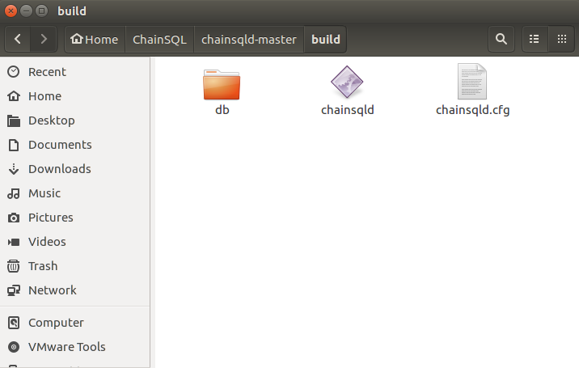
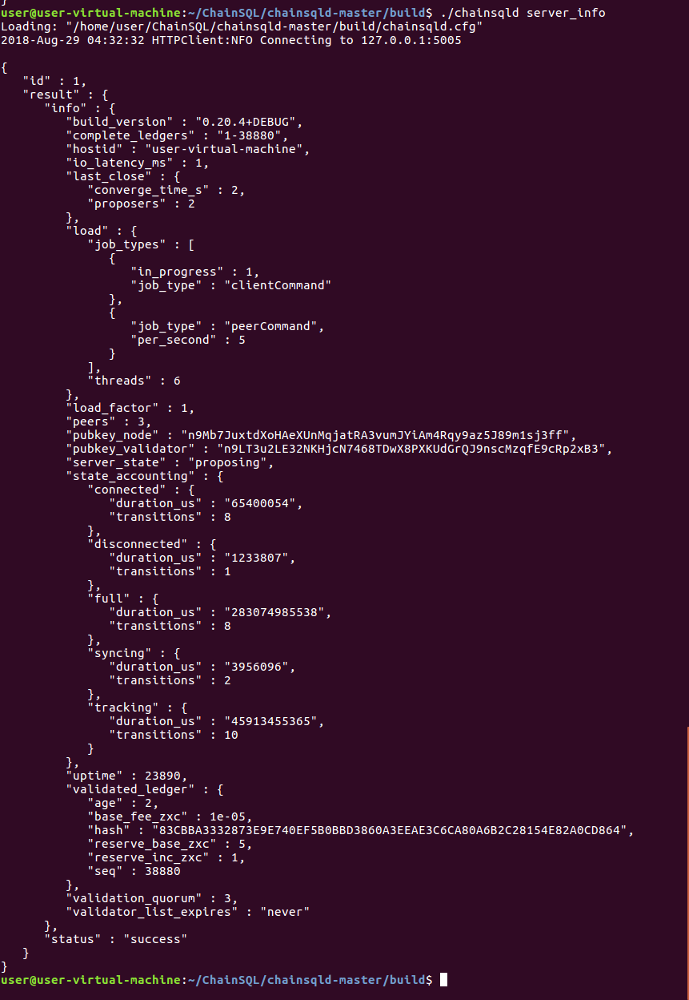
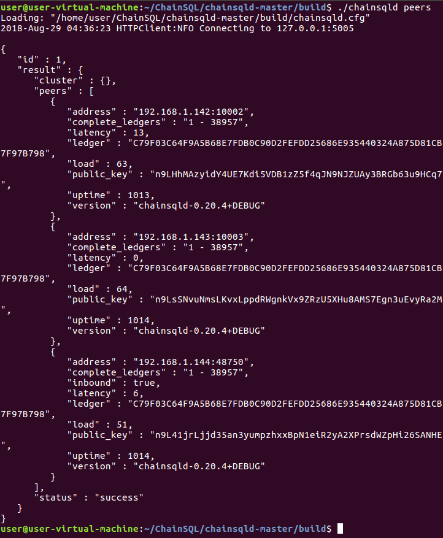
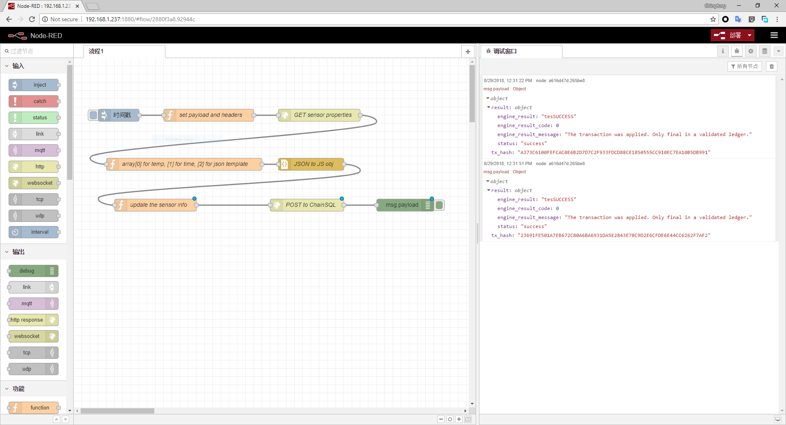

# ChainSQL 的安装及使用

## MySQL 的配置

参考 [GitHub Wiki](https://github.com/ChainSQL/chainsqld/blob/master/doc/manual/deploy.md)

只需要建好数据库并且更改为 UTF-8 编码即可

## ChainSQL 的编译 \(推荐使用Ubuntu 16.04\)

在`/chainsqld/Builds/Ubuntu/`下执行`install_boost.sh`和`build_clang_libs.sh`

然后在`/chainsqld`中使用 cmake 来编译安装

运行时需要 ripple 相关依赖, 运行`install_rippled_depends_ubuntu.sh`脚本

## ChainSQL 的配置

1. 首先将`validators.txt`的所有内容剪切到`chainsqld-example.cfg`中并删除源文件
2. 将`chainsqld-example.cfg` 重命名为 `chainsqld.cfg` 之后执行 `./chainsqld`
3. 然后另开终端执行`./chainsqld validation_create` 返回`validation_public_key`和`validation_seed`并写入`chainsqld.cfg`中的相应字段 \(如四个节点则需要重复四次此步骤\)
4. `[validators]`下填写其他节点的`validation_public_key`

经测试需要删除以下字段, 以仅使用`chainsqld.cfg`作为配置文件

```javascript
[validators_file]
validators.txt
```



* 在`[sync_db]`下配置好 mysql 相关信息
* 在`[ips_fixed]`下配置好其他三个节点的 IP 地址以及端口号, 例如

```
[ips_fixed]
192.168.1.142 10002
192.168.1.143 10003
192.168.1.144 10004
```

* 在 `[port_peer]`下填写本节点希望使用的端口

```
[port_peer]
port = 10001
ip = 0.0.0.0
protocol = peer
```

## 启动网络

在第一个节点首次需要使用`./chainsqld --start`来启动, 其他节点使用`./chainsqld`启动, 以后都用`./chainsqld`启动即可

启动完成后可以通过`watch ./chainsqld server_info`查看节点运行信息, 通过`watch ./chainsqld peers`查看各节点连接情况

常见问题排查: [FAQ](http://www.chainsql.net/faq.html)

## 使用 RPC 接口

参考 [GitHub WIki](https://github.com/ChainSQL/chainsqld/blob/master/doc/ChainSQLDesign.md#6-rpc-接口)

将 JSON 格式的文本 POST 到节点的 RPC 接口, IP 地址和端口写在`chainsqld.cfg`里的`[port_rpc_admin_local]`中

其中根账户地址为`zHb9CJAWyB4zj91VRWn96DkukG4bwdtyTh`

私钥为`xnoPBzXtMeMyMHUVTgbuqAfg1SUTb`

**具体操作的 JSON 如下**

[表改名](https://github.com/ycfung/ChainSQL-Docs/blob/master/.gitbook/assets/t_rename.txt)

[查询数据](https://github.com/ycfung/ChainSQL-Docs/blob/master/.gitbook/assets/r_get.txt)

[删除数据](https://github.com/ycfung/ChainSQL-Docs/blob/master/.gitbook/assets/r_delete.txt)

[插入数据](https://github.com/ycfung/ChainSQL-Docs/blob/master/.gitbook/assets/r_insert.txt)

[创建表](https://github.com/ycfung/ChainSQL-Docs/blob/master/.gitbook/assets/t_create.txt)

## 实例运行截图





## 使用基于 Node.js 的 Raspberry Pi 将传感器上传到数据库

此功能基于 [Node-RED](https://nodered.org/) 项目

传感器的数据发布在本地 HTTP 服务器上, 通过 GET 方法获取并按照 RPC 接口标准填好字段后 POST 到相应接口



测试用的 Flow 的配置如下:

[Flow](https://github.com/ycfung/ChainSQL-Docs/blob/master/.gitbook/assets/flow.json)

## 备注

在本地 MySQL 建好的 chainsql 数据库中会有两个表名, 一个是自动生成的`SyncTableState`记录了各个表的详细信息,其他都为用户生成的表, 表名经过了 hash, 需要在`SyncTableState`中查找对应的表, 至于表的内容没有经过加密, 可以在本地数据库进行查看, 但不应进行其他操作
